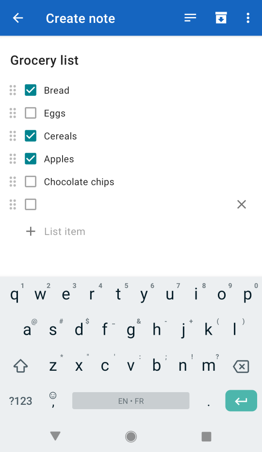

# Another notes app

This is a simple Android app for taking notes, like there have been tens of thousands before.
The app uses material UI and was built following MVVM architecture using Dagger and Jetpack
components.

#### Features
- Text and list notes.
- Archive and recycle bin.
- Searching notes.
- Synchronize & backup notes on the cloud.
- Light and dark theme support.

### Screenshots

  

### Changelog
[View changelog here][changelog] for the app release notes.

### Contributing
Contributions are welcome. For now the most important need is new translations.
- Please open an issue before submitting a pull request that adds a new feature, so it can be discussed.
- All changes should be committed the `dev` branch, not `master`.
- Make sure to follow existing code style.

### License
- All code is licensed under Apache License 2.0.
- Icons were mostly found at [Material Design Icons][mdi-icons], license can be found [here][mdi-icons-license].

[changelog]: CHANGELOG.md
[mdi-icons]: https://materialdesignicons.com
[mdi-icons-license]: https://github.com/Templarian/MaterialDesign#license
