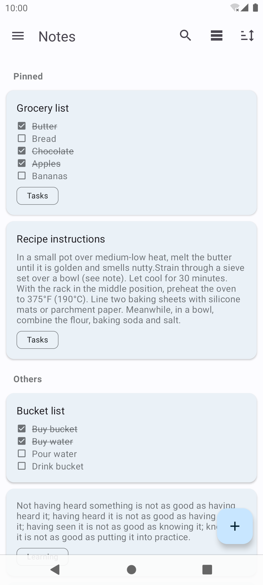

# Another notes app

*The app is not actively developed since I have deviated from Android development in recent years.
I'll fix critical bugs, but features may not be implemented before a very long time, if ever. 
Expect one release per year. I will accept and review pull requests though.*

This is a simple Android app for taking notes, like there have been tens of thousands before.
The app has Material UI, was built following MVVM architecture, uses Dagger and some Jetpack
components. Download is available on:

- [F-Droid](https://f-droid.org/en/packages/com.maltaisn.notes.sync/)
- [Direct APK download](https://github.com/maltaisn/another-notes-app/releases/latest)
- [Google Play Store](https://play.google.com/store/apps/details?id=com.maltaisn.notes.sync)

#### Features
- Text and list notes.
- Archive and recycle bin.
- Labeled notes.
- Reminders (including recurring).
- Searching notes.
- Light and dark theme support.
- Basic import and export.
- Somewhat customizable interface.

### Screenshots

  

### Changelog
[View changelog here][changelog] for the app release notes.

### Contributing
Contributions are welcome, especially translations (see [`TRANSLATING.md`][translating]).
- Please open an issue before submitting a pull request that adds a new feature, so it can be
    discussed.
- All changes should be committed the `dev` branch, not `master`.
- Make sure to follow existing code style (see `config/intellij-codestylexml` file).

### License & credits
- All code is licensed under Apache License 2.0.
- Icons were mostly found at [Material Design Icons][mdi-icons], license can be found
[here][mdi-icons-license].
- Thanks to the following contributors for translations:
    - Arabic: [@afmbsr](https://github.com/afmbsr)
    - German: [@memyselfandi](https://troet.cafe/@memyselfandi)
    - Italian: carallo ([Crowdin](https://crowdin.com/profile/carallo))
    - Norwegian: [@FTno](https://github.com/FTno)
    - Polish: Sebastian Jasiński ([Crowdin](https://crowdin.com/profile/princenorris))
    - Russian: Zakhar Timoshenko ([Crowdin](https://crowdin.com/profile/ztimms73))
    - Spanish: [@urizev](https://github.com/urizev)
    - Turkish: language_is_alive ([Crowdin](https://crowdin.com/profile/language_is_alive))
    - Ukrainian: axmed99 ([Crowdin](https://crowdin.com/profile/axmed99))

[changelog]: CHANGELOG.md
[translating]: TRANSLATING.md
[mdi-icons]: https://materialdesignicons.com
[mdi-icons-license]: https://github.com/Templarian/MaterialDesign#license
